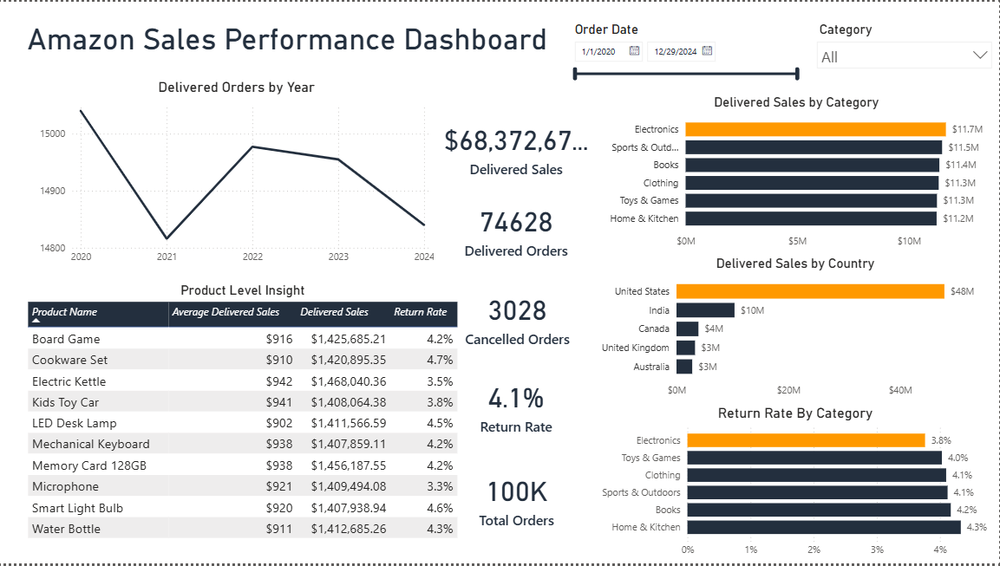
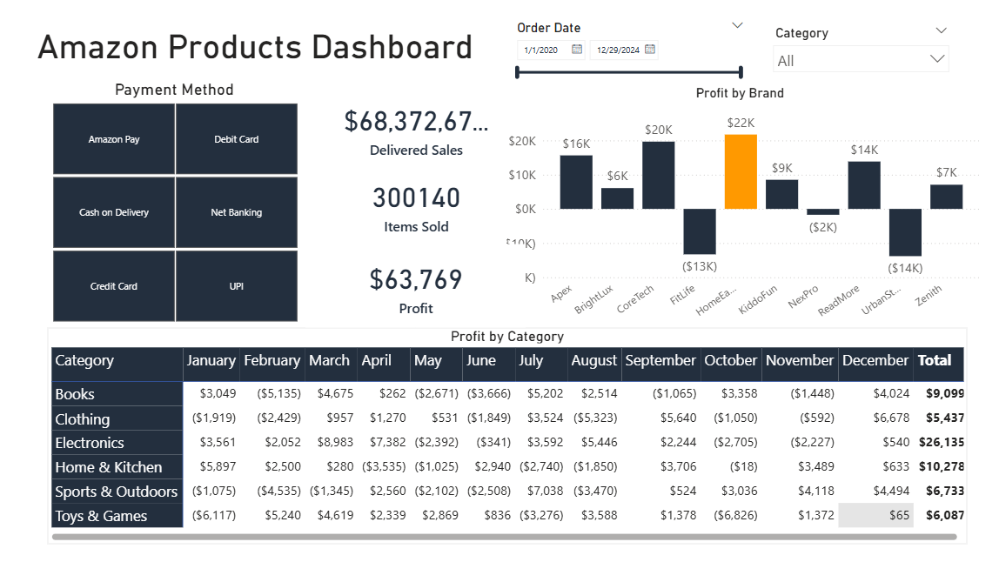
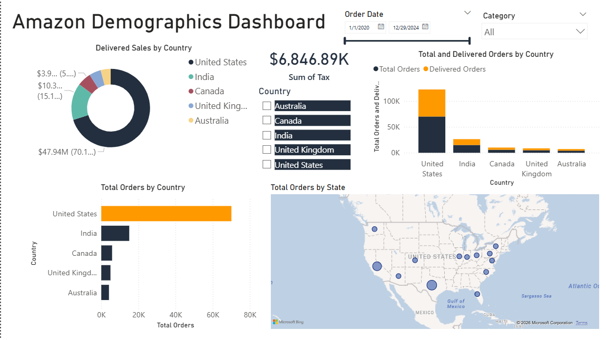
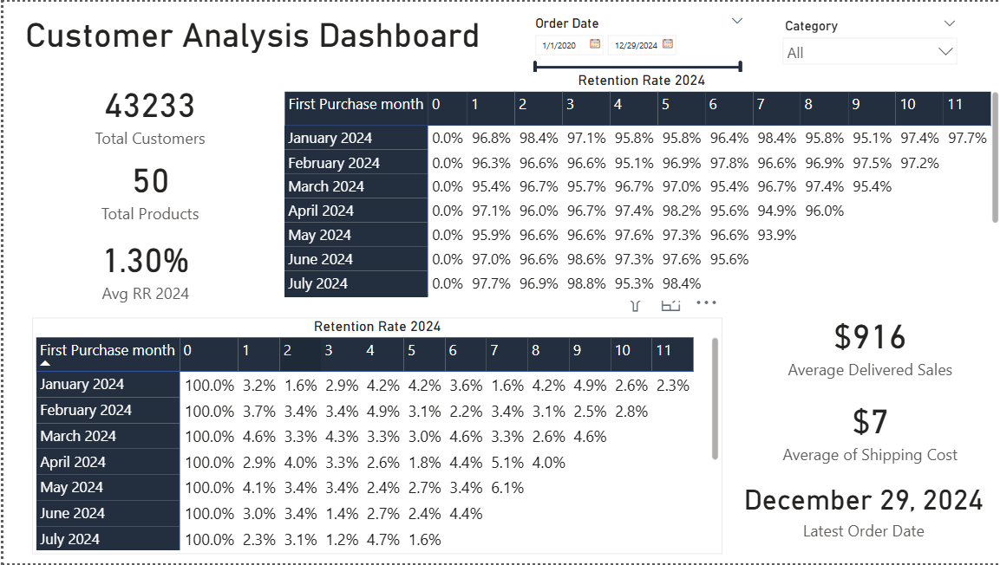

# Amazon Sales Dashboard (Power BI)

## Overview

Built an interactive **Power BI dashboard** to analyze Amazon sales performance, product profitability, customer demographics, and retention trends using a dataset of **100K+ orders**.

## Tools

Power BI • Excel • Data Visualization • Data Analysis

---

## Key Metrics

* **Total Orders:** 100K+
* **Delivered Orders:** 74K+
* **Cancelled Orders:** ~3K
* **Return Rate:** ~4%
* **Total Delivered Sales:** ~$68K

---

## Dashboards & Visualizations

### 1. Sales Performance

Visualizations:

* Delivered Orders by **Year (2020–2024)**
* Delivered Sales by **Product Category**
* Delivered Sales by **Country**
* **Return Rate by Category**

---

### 2. Product Analysis

Visualizations:

* **Monthly Profit by Category**
* **Profit by Brand**
* **Payment Method Distribution**

---

### 3. Customer Demographics

Visualizations:

* **Sales Distribution by Country**
* **Geographic Order Density Map**

---

### 4. Customer Retention

Visualizations:

* **Monthly Customer Retention Rate**
* **Customer Purchase Patterns**

---

## Key Insights

* **Electronics** generates the highest sales revenue.
* Majority of orders originate from the **United States**.
* Average return rate across categories is **~4%**.
* Customer retention remains **above 95% in most months**.

---

## Repository Files

* `Amazon_Sales_Dashboard.pbix` – Power BI dashboard file
* `amazon_sales_dataset.csv` – dataset used for analysis
* Dashboard screenshots

---

## Author

Jitesh
Aspiring Data Analyst | Power BI | SQL | Python

